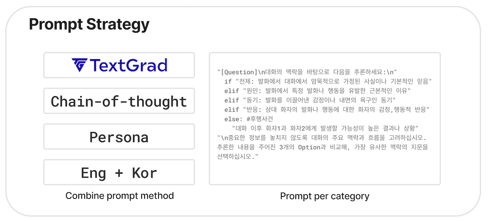
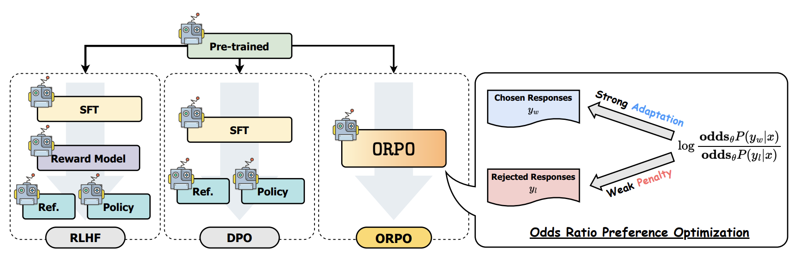
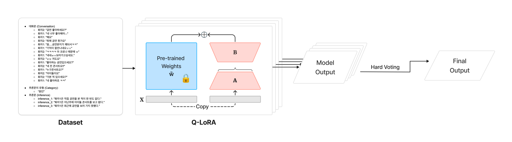

# 2024 국립국어원 인공지능의 한국어 능력 평가

대화 맥락 추론 (가 유형) - **모두의 말뿡치** 팀
> 리더보드 2위 모델- **'정말뿡'**


<br>
본 리포지토리는 '대화 맥락 추론'에 대한 모두의 말뿡치 팀의 제출 모델의 학습과 평가를 재현하기 위한 코드를 포함하고 있습니다.

<br>
<p align="center">

</p>

<br>

_학습 및 추론의 실행 방법은 아래에서 확인하실 수 있습니다._
</br>

## Table of Contents  
1. [소개](#1._소개)  
2. [데이터셋 소개](#2._데이터셋_소개) 
3. [EDA](#3._EDA)
4. [모델 개요](#4._모델_개요)
<br> a. [사용 모델 선택](##a._사용_모델_선택)
<br> b. [CoT](##b._CoT)
<br> c. [Persona](##c.Persona)
5. [사용 프롬프트](#5._사용_프롬프트)
... 추가 예정

---
<br>

## 1. 소개
‘대화 맥락 추론' 과제에서 **‘가'** 유형으로 외부 데이터를 사용하거나 데이터 증강 사용이 불가합니다.
<br>본 과제는 주어진 대화 내용을 바탕으로, 특정된 대상 발화로부터 다섯 가지의 추론문 유형인 ‘원인’, ‘후행 사건’, ‘전제 조건’, ‘내적 동기’, ‘감정 반응’ 중 하나에 상응하는 문장을 정확하게 추론하는 것을 목표로 합니다.
모델은 세 개의 추론 옵션 중 가장 적합한 답을 선택해야 하며, 이를 통해 모델의 대화 맥락 이해 능력과 적합한 추론 선택 능력을 평가합니다. </br>

<br>저희 모델은 대회의 기준 모델인 **불로섬(Bllossom)**-[`teddysum/Korean_CCI_2024`](https://github.com/MLP-Lab/Bllossom) 을 기반하여 구현되었으며, Bllossom은 한국어 데이터로 파인튜닝된 LLaMA3 기반의 한국어 대화 추론을 위해 설계된 모델입니다. 

### 모두의 말뿡치 팀 소개
> 연세대학교 빅데이터 학회 'YBIGTA'의 Data Science 팀 소속 학생들

<p align="center">

</p>


## 2. 데이터셋 소개
국립국어원에서 제공되는 대화 맥락 추론 말뭉치 데이터셋은 대화문, 대상 발화, 추론문의 유형, 추론문이 포함되어 있습니다. 
> 데이터 형식의 예시
<p align="center">

</p>


## 3. EDA
대화 맥락 추론 말뭉치 데이터셋의 train과 test에 대한 EDA (Exploratory Data Analysis) 결과는 [`eda/train`](./eda/train) 와 [`eda/test`](./eda/test) 디렉토리에 저장되어 있습니다.

> 대화 맥락 추론 말뭉치 train 데이터의 EDA 결과 예시
> 

> 탐색적 데이터 분석을 통한 인사이트를 통한 전처리 진행


## 4. 모델 개요

### a. 사용 모델 선택

대화 맥락 추론 과제를 수행하기 위해 사용된 모델의 종류는 아래와 같습니다.

- [`MLP-KTLim/llama-3-Korean-Bllossom-8B`](https://huggingface.co/MLP-KTLim/llama-3-Korean-Bllossom-8B)
- [`x2bee/POLAR-14B-v0.2`](https://huggingface.co/x2bee/POLAR-14B-v0.2)
- [`rtzr/ko-gemma-2-9b-it`](https://huggingface.co/rtzr/ko-gemma-2-9b-it)
- [`beomi/Solar-Ko-Recovery-11B`](https://huggingface.co/beomi/Solar-Ko-Recovery-11B)
- [`yanolja/EEVE-Korean-Instruct-10.8B-v1.0`](https://huggingface.co/yanolja/EEVE-Korean-Instruct-10.8B-v1.0)
- [`Qwen/Qwen2-7B`](https://huggingface.co/Qwen/Qwen2-7B)
- [`Qwen/Qwen2-7B-Instruct`](https://huggingface.co/Qwen/Qwen2-7B-Instruct)
- [`spow12/Qwen2-7B-ko-Instruct-orpo-ver_2.0_wo_chat`](https://huggingface.co/spow12/Qwen2-7B-ko-Instruct-orpo-ver_2.0_wo_chat)

<br>
위 모델은 다음과 같은 선정 기준과 과정을 거쳤습니다.
</br>

1. 한국어 추론 태스크를 위해 [한국어 모델의 오픈 리더보드](https://huggingface.co/spaces/upstage/open-ko-llm-leaderboard)를 참고하여 모델을 선정하였습니다.
2. 리더보드의 성능과 실제 사용 환경에서 성능이 다를 수 있으므로 신뢰할 수 있는 성능 발휘를 위하여 허깅페이스 다운로드 수, 한국어 NLP 오픈톡방에서 다수 언급된 모델을 고려하여 최종 8개 모델을 선정하였습니다.
3. 최종적으로 한국어 추론을 안정적이고 신뢰할 수 있는 성능으로 제공하고자 여러 모델을 선정 후 모델의 장점만을 선별하여 앙상블하는 방법을 채택하였습니다.
4. 대규모 언어 모델의 미세 조정을 더 경제적이고 실용적으로 만들어, 큰 모델도 작은 자원에서 효율적으로 학습 가능한 LoRA와 QLoRA를 사용하였습니다.

### b. 하이퍼 파라미터

### c. Parameter Efficient Fine Tuning (PEFT)
모델 훈련의 효율성을 높이기 위해, 파라미터 효율적으로 fine-tuning 하는 Parameter-Efficient-Fine-Tuning(PEFT)방법을 사용하여 학습에 필요한 메모리 용량과 계산량의 크기를 줄였습니다. PEFT에서도 [LoRA](https://arxiv.org/pdf/2106.09685)와 [QLoRA](https://arxiv.org/pdf/2305.14314)라는 두 가지 기법을 활용하여 자원 소모를 최소화하였습니다.

- **LoRA (Low-Rank Adaptation)**: Low-rank factorization 방법을 활용하여 LLM의 linear layer에 대한 업데이트를 근사화하는 방법입니다. 이는 모델의 전체 파라미터를 수정하지 않고도 성능을 향상시켰습니다.
- **QLoRA (Quantized LoRA Adapters)**: LoRA의 개념을 양자화하여 메모리와 연산 자원을 절약하면서도 효율적으로 모델을 적응시킵니다. 이는 리소스가 제한된 환경에서도 효율적인 모델 조정이 가능하게 해주었습니다.


<p align="center">

</p>


## 5. 사용 프롬프트
<p align="center">

</p>

### a. Textgrad
- TEXTGRAD는 딥러닝 작업의 결과물을 LLM이 평가하여 역전파(back propagation)로 수정하는 프레임워크로, Solution, Code Snippet뿐만 아니라 Prompt Optimization도 지원합니다.

<br>
<p align="center">

</p>
</br>

- 해당 프레임워크는 주어진 작업에 대해서만 사용할 수 있으며, 모듈에 직접 우리의 작업을 삽입하여 수정해야 하지만 모델과 태스크에 해당하는 최적의 프롬프트를 LLM이 찾아 제공할 수 있습니다.

### b. CoT
- [Chain-of-thought](https://arxiv.org/pdf/2201.11903) (Wei et al., 2022) 프롬프트는 중간 추론 단계를 통해 복잡한 추론이 가능하게 함. 이는 단계를 통해 한국어 맥락과 형태를 고려하여 추론 성능 향상이 가능하게 하였습니다.
<p align="center">

</p>

### c. Persona
- [Persona](https://arxiv.org/pdf/2302.11382) (White et al., 2022) 프롬프트 방법은 LLM에게 특정한 역할을 부여하여 역할에 걸맞는 추론을 가능하게 하였습니다.


### d. Categorized
- 카테고리별 데이터를 해당하는 카테고리 설명과 덧붙여 학습하게 함으로써 대화의 주요 맥락과 흐름을 고려하게 함. 이는 각자 특성을 가진 카테고리를 잘 고려하여 학습 및 추론할 수 있도록 하였습니다.

<p align="center">

</p>

### e. Korean & English
- 성능 향상을 위하여 영어로만 프롬프팅하거나, 한국어로만 프롬프팅하거나, 영어와 한국어를 합쳐서 사용하는 등 여러 방식을 혼용하여 사용하였습니다.


## 6. ORPO
모델의 성능을 높이기 위해, '[ORPO: Monolithic Preference Optimization without Reference Model](https://arxiv.org/pdf/2403.07691)' 논문에서 소개된 ORPO 방식을 사용하였습니다. 
<br>ORPO 방식은 "Odds Ratio Preference Optimization"의 약자로, reference model 없이도 선호도를 최적화하는 접근법으로, 추론문 유형별로 모델의 선택을 더욱 정교하게 조정하는 데 기여할 수 있는 방법입니다. </br>

기존 RL 방식과의 비교:



Forward pass 가 기존의 DPO와 RLHF 방식에 비해 절반으로 줄임으로써 메모리와 연산 효율성을 크게 향상시킵니다.

ORPO 는 `Qwen2` 모델들에 적용하였습니다.

## 7. Ensemble
한국어 추론을 안정적이고 신뢰할 수 있는 성능으로 제공하고자 여러 모델을 선정 후 모델의 장점만을 선별하여 앙상블하는 방법을 채택하였습니다.


<p align="center">

</p>


## 8.레포지토리 구조 (Repository Structure)

블라


## 8. 실행 방법 (How to Run)

#### Miniconda 설치
먼저 새로운 conda 환경을 생성합니다.
```bash
$ mkdir -p ~/miniconda3    # 사용자 홈 디렉토리에 'miniconda3' 디렉토리를 생성 (디렉토리가 이미 존재해도 오류 없이 진행)
$ wget https://repo.anaconda.com/miniconda/Miniconda3-latest-Linux-x86_64.sh    # Miniconda 설치 스크립트를 다운로드
$ bash Miniconda3-latest-Linux-x86_64.sh    # 설치 스크립트를 실행하여 Miniconda를 설치
$ rm ~/miniconda3/miniconda.sh   # 설치 후 불필요한 설치 스크립트 파일을 삭제
```
설치가 완료된 후, 새로 설치한 Miniconda를 초기화합니다.

```bash
$ ~/miniconda3/bin/conda init bash    # bash 셸에 conda 초기화 설정을 추가
$ ~/miniconda3/bin/conda init zsh    # zsh 셸에 conda 초기화 설정을 추가
$ conda --version    # 설치된 conda의 버전을 확인하여 설치가 성공적으로 완료되었는지 확인

``` 
새로운 터미널에서 conda 환경 생성 밎 실행

```bash
$ conda create -n Bbung python=3.9   #새로운 conda 환경을 생성
$ conda activate Bbung    #'Bbung' 환경 활성화
``` 

#### 환경 설정
```bash
$ git clone https://github.com/seodaegal/Ko_Conversational_Context_Inference.git    # 프로젝트 레포지토리를 클론
$ cd Ko_Conversational_Context_Inference    # 프로젝트 디렉토리로 이동
$ pip install -r requirements.txt    # 프로젝트에 필요한 패키지를 설치

```
### 데이터셋 업로드
[대회맥락추론 가 유형](https://kli.korean.go.kr/benchmark/taskOrdtm/taskDownload.do?taskOrdtmId=144&clCd=END_TASK&subMenuId=sub02) 내 `대화맥락추론_데이터.zip`을 다운받아주세요.

다운받은 파일을 [`resource/data`](/resource/data) 폴더에 넣습니다.
```bash
$ unzip resource/data/대화맥락추론_데이터.zip
```
이후 '대화맥락추론'을 'data'로 바꿔주세요.
```bash
$ mv 대화맥락추론_dev.json data_dev.json
$ mv 대화맥락추론_test.json data_test.json
$ mv 대화맥락추론_train.json data_train.json
```

최종 `resource/data` 파일 형식:

```bash
KR-Conversation-Inference
├── resource
│   │ 
│   ├── data # 데이터 파일 형식
│   │   └── data_dev.json
│   │   └── data_test.json
│   │   └── data_train.json
│   │   └── sample.json
│   │ 
│   └── ...  
└── ... 
```


---
## 9. 평가 결과
어쩌구


---
## 10. 추후 연구 계획


---
## 11. License
저쩌고

---
## 12. Reference