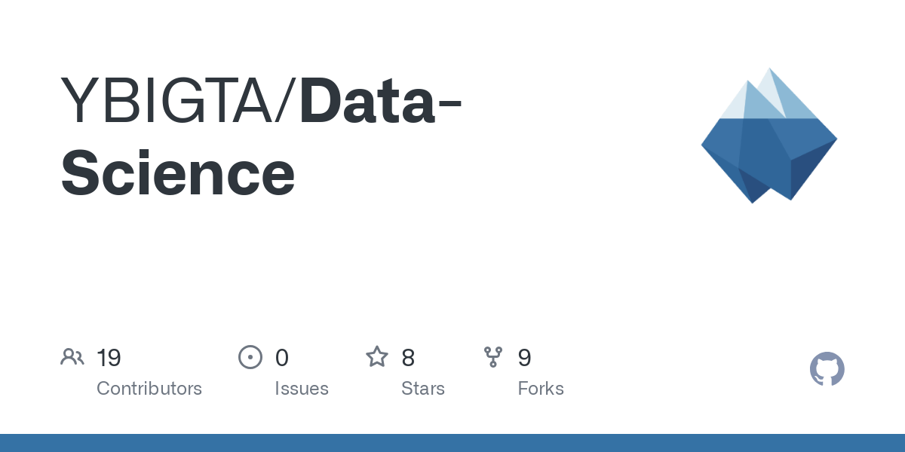

# 2024 국립국어원 인공지능의 한국어 능력 평가

대화 맥락 추론 (가 유형) - **모두의 말뿡치** 팀
> 리더보드 2위 모델- **'정말뿡'**

 
본 리포지토리는 '대화 맥락 추론'에 대한 모두의 말뿡치 팀의 제출 모델의 학습과 평가를 재현하기 위한 코드를 포함하고 있습니다.

 

 

_학습 및 추론의 실행 방법은 아래에서 확인하실 수 있습니다._
 

## Table of Contents  
1. [소개](#1._소개)  
2. [데이터셋 소개](#2._데이터셋_소개) 
3. [EDA](#3._EDA)
4. [모델 개요](#4._모델_개요)
  a. [사용 모델 선택](##a._사용_모델_선택)
  b. [CoT](##b._CoT)
  c. [Persona](##c.Persona)
5. [사용 프롬프트](#5._사용_프롬프트)
... 추가 예정

---
## 1. 소개
‘대화 맥락 추론' 과제에서 **‘가'** 유형으로 외부 데이터를 사용하거나 데이터 증강 사용이 불가합니다.
 본 과제는 주어진 대화 내용을 바탕으로, 특정된 대상 발화로부터 다섯 가지의 추론문 유형인 ‘원인’, ‘후행 사건’, ‘전제 조건’, ‘내적 동기’, ‘감정 반응’ 중 하나에 상응하는 문장을 정확하게 추론하는 것을 목표로 합니다.
모델은 세 개의 추론 옵션 중 가장 적합한 답을 선택해야 하며, 이를 통해 모델의 대화 맥락 이해 능력과 적합한 추론 선택 능력을 평가합니다.  

 저희 모델은 대회의 기준 모델인 **불로섬(Bllossom)**-[teddysum/Korean_CCI_2024](https://github.com/MLP-Lab/Bllossom) 을 기반하여 구현되었으며, Bllossom은 한국어 데이터로 파인튜닝된 LLaMA3 기반의 한국어 대화 추론을 위해 설계된 모델입니다. 

### 모두의 말뿡치 팀 소개
> 연세대학교 빅데이터 학회 'YBIGTA'의 Data Science 팀 소속 학생들

---
## 2. 데이터셋 소개
국립국어원에서 제공되는 대화 맥락 추론 말뭉치 데이터셋은 대화문, 대상 발화, 추론문의 유형, 추론문이 포함되어 있습니다. 
> 데이터 형식의 예시

---
## 3. EDA
대화 맥락 추론 말뭉치 데이터셋의 train과 test에 대한 EDA (Exploratory Data Analysis) 결과는 ['eda/train'](./eda/train) 와 ['eda/test'](./eda/test) 디렉토리에 저장되어 있습니다.

> 대화 맥락 추론 말뭉치 train 데이터의 EDA 결과 예시
> 
> 탐색적 데이터 분석을 통한 인사이트를 통한 전처리 진행

---
## 4. 모델 개요

### a. 사용 모델 선택

대화 맥락 추론 과제를 수행하기 위해 사용된 모델의 종류는 아래와 같습니다.

- 
-
- 

### b. 하이퍼 파라미터
솰라솰라

### c. Parameter Efficient Fine Tuning
모델 훈련의 효율성을 높이기 위해, 파라미터 효율적으로 fine-tuning 하는 Parameter-Efficient-Fine-Tuning(PEFT)방법을 사용하여 학습에 필요한 메모리 용량과 계산량의 크기를 줄였습니다. PEFT에서도 [LoRA](https://arxiv.org/pdf/2106.09685)와 [QLoRA](https://arxiv.org/pdf/2305.14314)라는 두 가지 기법을 활용하여 자원 소모를 최소화하였습니다.

- **LoRA (Low-Rank Adaptation)**: Low-rank factorization 방법을 활용하여 LLM의 linear layer에 대한 업데이트를 근사화하는 방법입니다.

- **QLoRA (Quantized LoRA Adapters)**: LoRA의 개념을 양자화하여 메모리와 연산 자원을 절약하면서도 효율적으로 모델을 적응시킵니다.

---
## 5. 사용 프롬프트
### a. Textgrad
blah
### b. CoT
blah

### c. Persona
blah 

### d. Categorized
blah

### e. Korean & English

---
## 6. Ensemble
blah

---
## 7. ORPO
모델의 성능을 높이기 위해, '[ORPO: Monolithic Preference Optimization without Reference Model](https://arxiv.org/pdf/2403.07691)' 논문에서 소개된 ORPO 방식을 사용하였습니다. 
 ORPO 방식은 "Odds Ratio Preference Optimization"의 약자로, reference model 없이도 선호도를 최적화하는 접근법으로, 추론문 유형별로 모델의 선택을 더욱 정교하게 조정하는 데 기여할 수 있는 방법입니다.  

기존 RL 방식과의 비교:

Forward pass 가 기존의 DPO와 RLHF 방식에 비해 절반으로 줄임으로써 메모리와 연산 효율성을 크게 향상시킵니다.

---
## 8. 실행 방법
어쩌구

---
## 9. 평가 결과
어쩌구

---
## 10. License
저쩌고

---
## 11. Reference